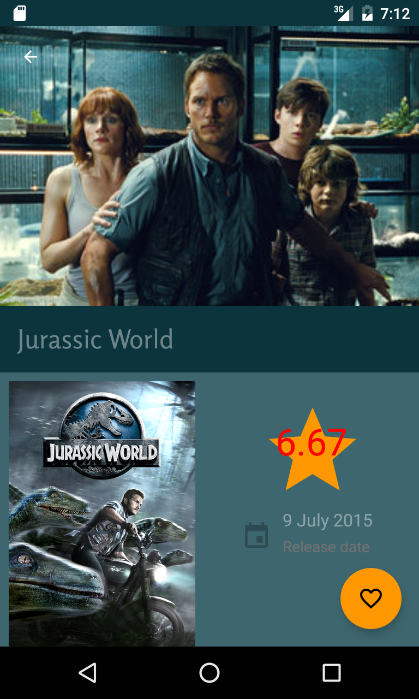

Popular Movies
==============

    <object classid='clsid:02BF25D5-8C17-4B23-BC80-D3488ABDDC6B'
        width="600" height="400"
        codebase='http://www.apple.com/qtactivex/qtplugin.cab'>
        <param name='src' value="assets/videos/movie.mov">
        <param name='autoplay' value="false">
        <param name='controller' value="true">
        <param name='loop' value="false">

        <embed src="demo.mov" width="600" height="400"
        scale="tofit" autoplay="false"
        controller="true" loop="false" bgcolor="#000000"
        pluginspage='http://www.apple.com/quicktime/download/'>
        </embed>
    </object>

<table border="0">
    <th border="0">
        
        
    </th>
    <th align="left">
        <li> Browse popular movies
          
        <li> View trailers and reviews
          
        <li> Favorite your preferred movies
    </th>
</table> 

Installation Instructions
-------------------------
An API key from themoviedb.org is required in gradle.properties to build the app
<ul>
<li>Create an <A href=https://www.themoviedb.org/account/signup>account</A>
<li>Set TMDB_API_KEY="your API Key" in the gradle.properties file
</ul>

Building from the command Line
------------------------------
<ul>
<code>git clone https://github.com/jdesesquelles/PopularMovies</code> 
<code>cd PopularMovies</code> 
<code>export ANDROID_HOME=/Library/Android/sdk</code> 
<code>read API_KEY</code> 
<code>echo "TMDB_API_KEY=\"$API_KEY\"" >> gradle.properties</code> 
<code>./gradlew installProdDebug</code> 
</ul>

Requirements
------------
<ul>
<li> minSdkVersion 21
<li> targetSdkVersion 23
<li> compileSdkVersion 23
<li> buildToolsVersion 23.0.2
</ul>