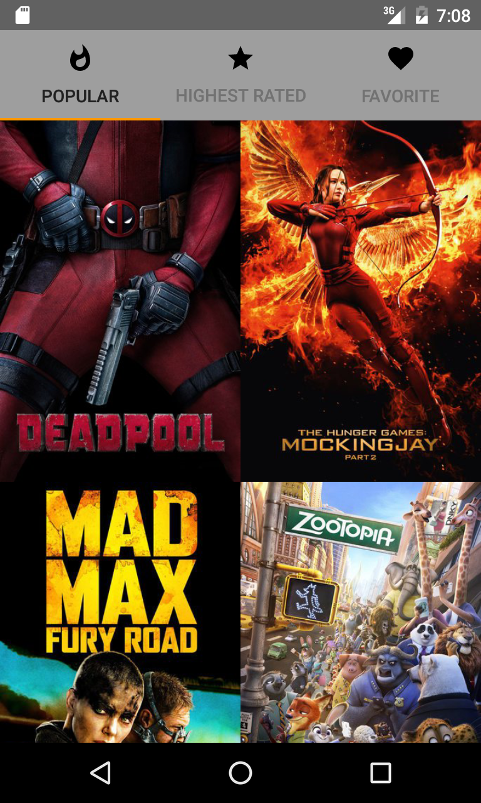

Popular Movies
==============

Installation Instructions
-------------------------
For the application to build properly, you will need an API key from themoviedb.org.
* Create an account at https://www.themoviedb.org/account/signup
* Get the API key and fill the gradle.properties TMDB_API_KEY=""

From the command Line:

&nbsp;&nbsp;`git clone https://github.com/jdesesquelles/PopularMovies`

&nbsp;&nbsp;`cd PopularMovies`

&nbsp;&nbsp;`export ANDROID_HOME=/Library/Android/sdk`

&nbsp;&nbsp;`read API_KEY`

&nbsp;&nbsp;`echo "TMDB_API_KEY=\"$API_KEY\"" >> gradle.properties`

&nbsp;&nbsp;`./gradlew installProdDebug`

## Requirements

* minSdkVersion 21

* targetSdkVersion 23

* compileSdkVersion 23

* buildToolsVersion 23.0.2